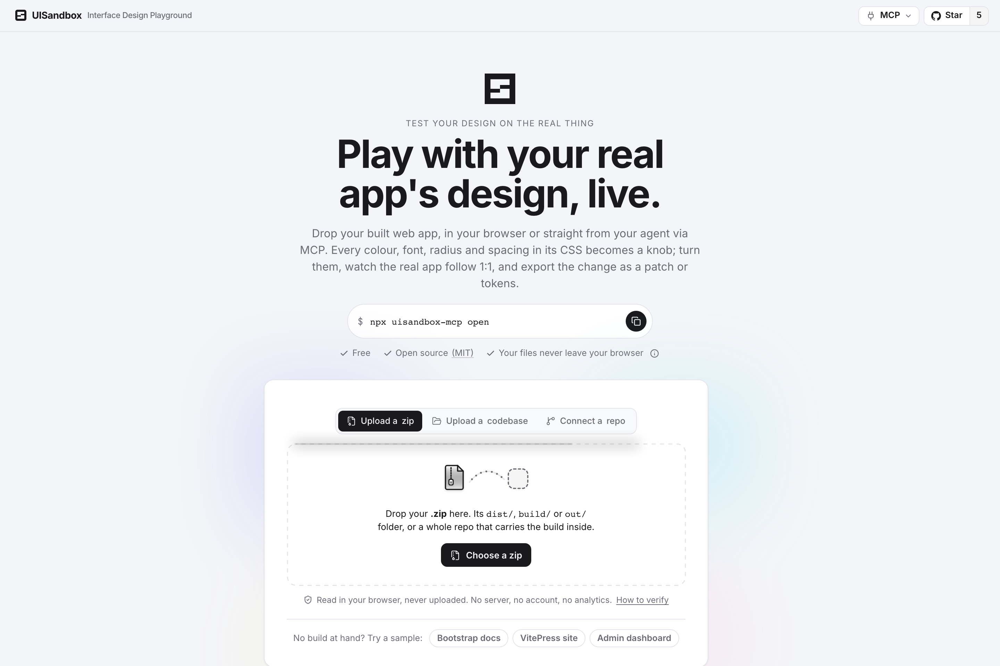
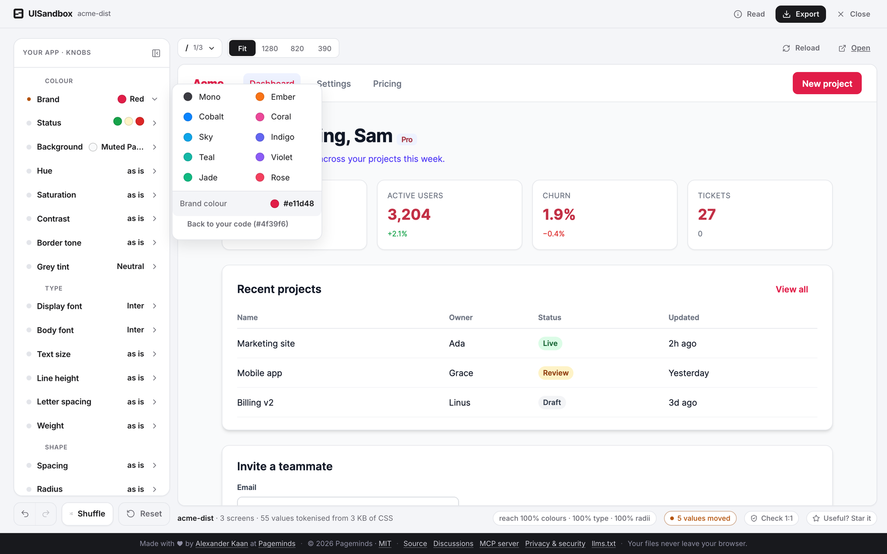

<p align="center">
  <a href="https://uisandbox.org"></a>
</p>

<h1 align="center">UISandbox</h1>

<p align="center"><b>Play with your real app's design, live.</b><br>
Restyle your app without rebuilding it — drop the build, turn the knobs, watch it follow 1:1, export the patch.<br>
<sub>Test your design on the real thing.</sub></p>

<p align="center">
  <a href="https://uisandbox.org">uisandbox.org</a> ·
  <a href="https://www.npmjs.com/package/uisandbox-mcp">npm: uisandbox-mcp</a> ·
  <a href="https://registry.modelcontextprotocol.io/v0/servers?search=uisandbox">MCP registry</a> ·
  <a href="LICENSE">MIT</a>
</p>

<p align="center">
  
  
  
  
</p>

```bash
npx uisandbox-mcp open            # run inside your project: it finds the build and opens the sandbox — no agent needed
```

Or drop a zip on **[uisandbox.org](https://uisandbox.org)** — no build at hand? *Try a sample* under the drop zone (the Bootstrap docs, a VitePress site, an admin dashboard). Or, in Claude Code: `/plugin marketplace add AlexanderKaan/uisandbox` → `/plugin install uisandbox@uisandbox` and say *"open this app in UISandbox"*.

<p align="center"></p>

## What it does

1. **Bring the build** — three ways in: a zip of `dist/`, `build/`, `out/` (or a whole repo with the build inside); a folder (a build renders, a source folder is read for the knob stand); a public GitHub or GitLab repo URL (fetched as a zip through a same-origin route — the one thing that leaves the tab, see [`notes/security.md`](notes/security.md)). While it works, the door shows the stages with their numbers. Otherwise your files never leave your browser: files are read in the page and served to the frame by a service worker on this origin.
2. **See it 1:1.** Every colour, radius, font, size, spacing, line-height, letter-spacing, weight, border-width, duration, gradient angle and shadow literal in your CSS becomes a variable holding the very same value, so the page renders exactly as it was — runtime styles too (`style=""` set by JS, `<style>` your framework appends, `insertRule`/`replaceSync` from styled-components, Emotion, Lit, Ant's cssinjs; CDN stylesheets through a same-origin proxy; nested same-origin frames such as Storybook's).
3. **Turn the knobs.** Brand, and the colour families your CSS actually contains (secondary, accent, the status set, a palette row for what is neither); page background; grey tint and border tone; display and body font (yours listed first, then alternatives by character); dials for text size, line height, letter spacing, weight, spacing, radius, border width, elevation, motion and gradient angle — every dial with **×1 = as in your code** at its centre; global hue, saturation and contrast that reach every colour, chart palettes and CSS-drawn icons included; your dark mode, switched on your own hooks.
4. **Export.** Your values as CSS / JSON / a patch list, your files patched in place, `--k-*` tokens for web (CSS, Tailwind, shadcn), Swift constants + an asset catalog for iOS, `colors.xml` + Kotlin for Android.

## Honest by construction

- **"1:1" is measured, not felt.** *Check 1:1* loads the untouched build and the tokenised build side by side and diffs the computed styles of every element (18 properties, shadow roots and nested frames included). Zero differences or it says what differs.
- **A reach meter** in the stage foot says how much of what you see the knobs touch — painted colours, families, sizes, radii — and what lies outside (images, canvas, video).
- **It refuses what it cannot show.** iOS/Android projects, WordPress themes and source without a build get a clear message at the door; a page that asks for files the archive does not hold says so ("that usually means source, not the built output").
- **A hostile archive** cannot navigate the tool away, register its own service worker or unregister ours, or smuggle a zip-slip path back out of an export. What it can do — reach the tool's DOM, because the frames are same-origin by design — reaches nothing worth having: no server, no credentials, no state. Read [`notes/security.md`](notes/security.md); deploy on an origin of its own.

## Run it

```bash
pnpm install
pnpm dev        # http://localhost:5190
pnpm test       # vitest + node:test (audit engine)
pnpm build      # dist/ — static; public/_headers rides along
pnpm holdouts   # every fixture zip through the real app in headless Chromium (see below)
```

`http://localhost:5190/?load=<zip-url>` loads a zip by URL (same-origin or CORS) — the door an agent uses.

## Hold it to account

`pnpm holdouts` runs every archive in `fixtures/` (real builds from public repos — gitignored, [`notes/decisions.md`](notes/decisions.md) says where each came from) through the app: load, Check 1:1, reach, and a host check (same origin, one worker). Verdicts are held against [`scripts/holdouts.expect.json`](scripts/holdouts.expect.json); a fixture expected `ok` that is not fails the run. `--only <name>`, `--record`, `--base <url> --fixtures <url>` for a production build or the live site.

## How it works

```
src/
  sandbox/
    rewrite.ts   their CSS/HTML → literals replaced by var(--us-vN); byte-preserving
    table.ts     the substitution sheet: one entry per (kind, value), with sites
    mapping.ts   knob → their values, RELATIVE to the baseline (identity at rest); families
    baseline.ts  the knobs on the stand of THEIR code (audit + the sheet + the rendered page)
    project.ts   root and deploy-base detection · screens · raw + rewritten files · guard + hook
    host.ts      owns the sandboxes, answers the service worker; live vars injected into HTML
    verify.ts    the 1:1 check: raw vs identity, computed styles per element
    coverage.ts  the reach meter
    live.ts      MutationObserver: runtime style="" and <style> get the same rewrite
    scheme.ts    their dark mode: hooks found in their CSS, switched
  public/sw.js   serves a sandbox document's URLs from the page; /__ext/ proxies CDN CSS
  tokens/ panel/ state/ export/ audit/   the knob engine, panel, undo/hash, exporters, source audit
notes/           decisions (numbered), traps, lessons, security, roadmap
```

## MCP

`npx -y uisandbox-mcp` ([npm](https://www.npmjs.com/package/uisandbox-mcp)) — or `pnpm mcp` from a clone — runs the same engine as an MCP server (stdio): `load` a zip by URL or path, `set` knobs, `export` any format, `verify` the 1:1 check and `screenshot` in headless Chromium against the real app. See [`mcp/README.md`](mcp/README.md) for the tool list and the Claude/Cursor config. **Claude Code plugin** (skill + server in one): `/plugin marketplace add AlexanderKaan/uisandbox` then `/plugin install uisandbox@uisandbox` — gives `/uisandbox` ("open this app in a sandbox", "try brand #e11d48") and the `uisandbox` MCP server. The skill alone is [`skills/uisandbox/SKILL.md`](skills/uisandbox/SKILL.md) (copy into `.claude/skills/`). Codex / Cursor / others: add the MCP server (`npx -y uisandbox-mcp`); the server sends its own instructions and prompts.

## Deploy

One origin, one Cloudflare Worker (`worker/index.mjs`, `wrangler.jsonc`): static assets from `dist/`, the SPA fallback for `?load=`, http→https and www→apex redirects, and the `/__repo/` route that fetches a public GitHub zip for "Connect a repo" (nothing stored; same-origin callers only; a rate-limit rule in the zone). `public/_headers` keeps `sw.js` uncached and sets the security headers. Put nothing else on the origin — the sandboxed frames are same-origin by design ([`notes/security.md`](notes/security.md)).

## Roadmap

[`notes/roadmap.md`](notes/roadmap.md): ship (uisandbox.org) · the intake as a front door · being found (SEO, `llms.txt`, analytics) · the MCP server · after launch.

---

Made with ♥ by [Alexander Kaan](https://github.com/AlexanderKaan) at [Pageminds](https://pageminds.com/) · [MIT](LICENSE), free forever · the decisions that shaped it, numbered: [`notes/decisions.md`](notes/decisions.md)
